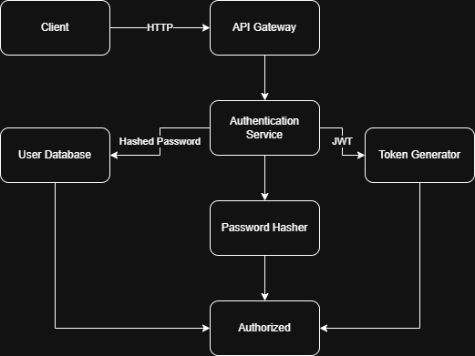

# Authentication System Design Document

## Overview
This document describes the architecture and design of a basic, scalable user authentication system. The System handles user registration, secure password storage, and login functionality.

## System Architecture Diagram

### Components
## Client
- Sends HTTP requests for user registration and login.
- Stores JWT securely (e.g., HTTP cookies or scure local storage)

## API Gateway
- Acts as an entry point.
- Can perform basic request validation, routing, rate-limiting, and logging.

## Authentication Service
- Core logic for registration and login.
- Validates input and manages user sessions.

## User Database
- Stores user data securely.
- Passwords are stored as hashed values.

## Token Generator
- Issues signed JWTs with claims (user ID, role, expiration time).
- Verifies tokens during API access.

## Password Hasher
- It use Password Generator to make security Password to Database (e.g. MD5Hash)

### Key Functionalities
## User Registration
- Endpoint: Post /register
- Input: username, password
- Password is hashed using bcrypt or MD5 before storing
- Stores user record in the database.

## User Login
- Endpoint: Post /login
- Input: username, password
- Retrieves user from DB, compares hash with entered password.
- If valid, returns JWT token with expiration.

### Security Measures
## Token-Based Authentication(JWT)
- Signed using HAMC.
- Expire tokens after a short period (e.g. 8 hours).
- Optionally store refresh tokens securely.

## Protections
- Rate limiting for login attempts.
- Account lockout after repeated failures.
- e.g. CAPTCHA, 2FA, email verification.